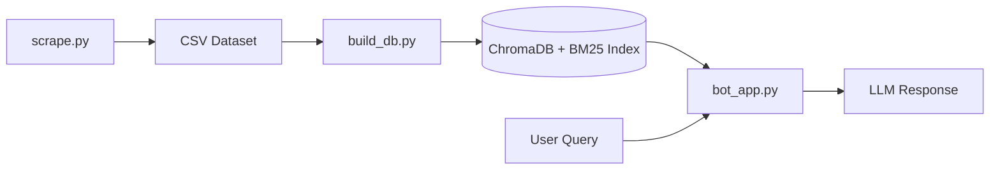

# ⚖️ ทนายจ๋า (Tanai-Ja): AI Legal Consultant for Thai Defamation Law

**ทนายจ๋า CHATBOT** is an intelligent legal assistant designed to provide clear and accurate advice on Thai defamation law (หมิ่นประมาท). Developed as a portfolio-ready project for the **CP465 Text Mining** course, it leverages a Hybrid Retrieval-Augmented Generation (RAG) architecture to bridge the gap between complex legal jargon and accessible public guidance.

---

## 🌟 Business Context & Impact

### The Problem: Navigating Defamation Law
Thai defamation law is nuanced and context-heavy. For the general public, understanding whether a statement constitutes a legal offense or finding relevant Supreme Court precedents is often a slow and expensive process.

### The Solution: ทนายจ๋า (Tanya-Ja)
This chatbot serves as a friendly, expert legal consultant. It simplifies complex legal concepts and case precedents into easy-to-understand language, providing instant, evidence-based preliminary advice.

### Chatbot Capabilities
The bot is programmed with a specific persona and response guidelines:
*   **Offense Verdict:** Clearly states if an act is "Likely an offense," "Unlikely," or "Ambiguous."
*   **Evidence-Based:** Every response is backed by specific **Legal Articles (มาตรา)** and **Supreme Court Judgments (ฎีกา)**.
*   **Semantic Understanding:** Can identify defamatory intent even if specific keywords aren't present (e.g., matching slang to formal legal definitions).
*   **No Hallucinations:** Politely declines to answer if the context does not contain relevant legal information.

---

## ⚙️ Technical Architecture

The system utilizes a **Hybrid RAG (Retrieval-Augmented Generation)** pipeline to ensure both keyword precision and semantic depth.

### Data Pipeline
<div align="center" style="background-color: white; padding: 20px; border-radius: 10px;">



</div>

| Component | Technology | Role |
| :--- | :--- | :--- |
| **LLM** | **gemma4:e2b** (via Ollama) | Generates human-like, expert legal responses locally. |
| **Orchestration** | **LangChain** | Manages the RAG pipeline and Ensemble Retriever. |
| **Vector DB** | **ChromaDB** | Semantic search using `paraphrase-multilingual-MiniLM-L12-v2`. |
| **Keyword Search** | **BM25** | Lexical search using PyThaiNLP `newmm` tokenizer. |
| **NLP Engine** | **PyThaiNLP** | Handles Thai tokenization and text processing. |
| **Scraping** | **BeautifulSoup** | Extracts data from official Supreme Court databases. |

### Hybrid Retrieval Strategy
We use an `EnsembleRetriever` with a **50/50 weight** split:
1.  **BM25 Retriever:** Captures exact legal terms and article numbers (Lexical).
2.  **ChromaDB Retriever:** Understands the semantic context and intent of the user's query (Vector).

---

## 🛠️ Installation & Setup

### 1. Prerequisites
*   Python 3.10+
*   [Ollama](https://ollama.com) installed and running.

### 2. Environment Setup
```bash
# Clone the repository
git clone https://github.com/your-username/lawyer-chatbot.git
cd lawyer-chatbot

# Create and activate virtual environment
python -m venv env
source env/bin/activate  # On Windows: .\env\Scripts\activate

# Install dependencies
pip install -r requirements.txt
```

### 3. Model Preparation (Ollama)
Ensure the local LLM is available:
```bash
ollama pull gemma4:e2b
ollama serve
```

### 4. Data Initialization
You can download the pre-built database or build it from scratch.

*   **Option A: Download (Recommended)**
    Download the `chroma_db` folder from [Google Drive](https://drive.google.com/drive/folders/1ZZIdGLfIbw2hEILRN9P7pEAgRN-ZT1vg?usp=sharing) and place it in the root directory.

*   **Option B: Build from Scratch**
    ```bash
    # Scrape data (approx. 79 pages of judgments)
    python scrape.py

    # Build ChromaDB + BM25 index
    python build_db.py
    ```

---

## 🚀 Usage

### CLI Mode (Terminal)
Interact with the bot directly in your terminal:
```bash
python bot_app.py --mode cli
```

### Telegram Mode
1.  Create a bot via [@BotFather](https://telegram.me/BotFather) to get your `API_TOKEN`.
2.  Run the bot:
```bash
python bot_app.py --mode telegram --token YOUR_BOT_TOKEN
```
Alternatively, set the token as an environment variable:
```bash
# Windows (PowerShell)
$env:TELEGRAM_BOT_TOKEN = "YOUR_BOT_TOKEN"
python bot_app.py --mode telegram
```

---

## 📄 Data Sources
*   **Supreme Court Judgments (คำพิพากษาฎีกา):** Scraped from [deka.supremecourt.or.th](https://deka.supremecourt.or.th).
*   **Thai Law Dataset:** Utilizes `pythainlp/thailaw-v1.0` for comprehensive legal section coverage.

## 🚧 Challenges & Future Roadmap
*   **Context Window:** Optimizing long legal texts for better LLM ingestion.
*   **Performance:** Improving inference speed for local model execution.
*   **Scalability:** Exploring quantized models and vector index optimizations.

---
*Developed as part of the CP465 Text Mining course project.*
